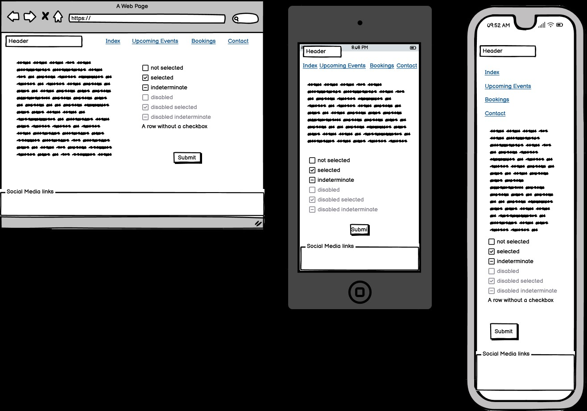
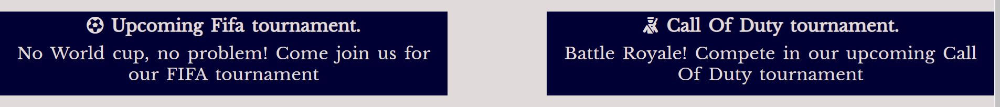
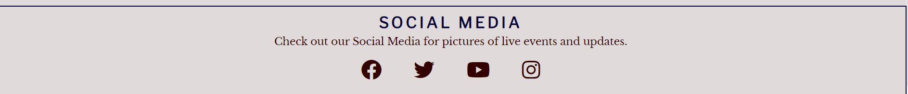
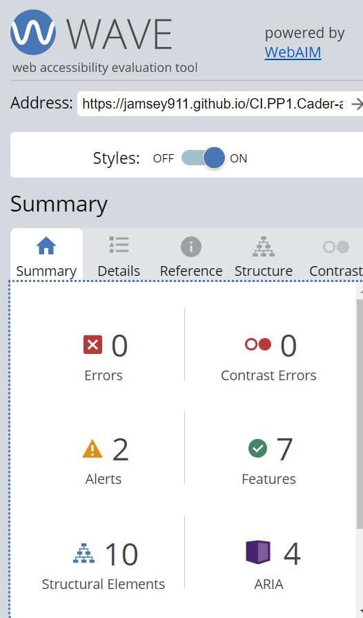

# Cader Arcade
(Developer: James Lynch)

[Live webpage](https://jamsey911.github.io/CI.PP1.Cader-arcade/index.html)

## Table of Content

1. [Project Goals](#project-goals)
    1. [User Goals](#user-goals)
    2. [Site Owner Goals](#site-owner-goals)
2. [User Experience](#user-experience)
    1. [Target Audience](#target-audience)
    2. [User Requrements and Expectations](#user-requrements-and-expectations)
    3. [User Stories](#user-stories)
3. [Design](#design)
    1. [Design Choices](#design-choices)
    2. [Colour](#colours)
    3. [Fonts](#fonts)
    4. [Structure](#structure)
    5. [Wireframes](#wireframes)
4. [Technologies Used](#technologies-used)
    1. [Languages](#languages)
    2. [Frameworks & Tools](#frameworks-&-tools)
5. [Features](#features)
6. [Testing](#validation)
    1. [HTML Validation](#HTML-validation)
    2. [CSS Validation](#CSS-validation)
    3. [Accessibility](#accessibility)
    4. [Performance](#performance)
    5. [Device testing](#performing-tests-on-various-devices)
    6. [Browser compatibility](#browser-compatability)
    7. [Testing user stories](#testing-user-stories)
8. [Bugs](#Bugs)
9. [Deployment](#deployment)
10. [Credits](#credits)
11. [Acknowledgements](#acknowledgements)

## Project Goals 

### User Goals
- I want a place to engage and socialize with fellow gamers in a communal setting.
- I Want to sign up for upcoming events
- I want to be adived when ther  next compeditive compititions take place
- I want to place a booking for a group
- I want to be advised on the opeing hours and contact details
- I want links to their social media for futher updates and live posts.

### Site Owner Goals
- Increase in the number of customers.
- Promote the bussines.
- Provide a way for new and existing customers to contact the buissnes.
- Provide essential information about the bussines to customers.

## User Experience

### Target Audience
- People looking for a place to play Arcade games
- People looking for Gaming events
- Small groups of people looking to book for a fun night
- Family, friends and corporate events

### User Requrements and Expectations

- A simple and informative navigation system
- Releavent information is user friendly
- All navigation correctly displayed
- An appealling looking website
- All contact information correctly displayed
- Simple forms to book an event, message the business or sign up for an event

### User Stories

#### First-time User 
1. As a first time user, I want to know where the Arcade is located
2. As a first time user, I want to know the events that take place
3. As a first time user, I want to get a feel for the Arcade
4. As a first time user, I want to get be able to ask a question if needed
5. As a first time user, I want to make a booking

#### Returning User
6. As a returning user, I want to sign up for upcoming events takeing place
7. As a returnign user, I want to know the opening times
8. As a returning user, I want to find a phone number to call for booking
9. As a returning user, I want to find an email to email the Arcade
10. As a returning user, I want to leave a comment, suggestion or message to the staff
11. As a returning user, I want to find the Arcade on social media
12. As a returning user, I want to know details in regards to making a booking
13. As a returning user, I want to get directions to the Arcade

#### Site Owner 
14. As the site owner, I want users to find out about upcoming events
15. As the site owner, I want users to get to know the Arcade 
16. As the site owner, I want the users to be able to contact us

<!-- Day 2 -->
## Design

### Design Choices
This project has been created out of my love for video games and wish for something when i was younger for a local arcade to have live inhouse tournaments where i could socialise with fellow gamers. 

My goal is to create a welcoming yet efficent website so people of all ages feel at ease while they navigate through the content. In order to achieve this, all relevant content is made easy to read in the index with links to the sign up page for any upcoming events that are taking place another seperate page to book for a party(Birthday, confirmation, christmas) and another page with all relevant contact information.

### Colour
 The colour sheme was chosen as a dark red and dark blue theme, and was also aided by colorhexa in which a Split Complementary Color was selected. A light grey and soft yellow was used to give it contrast which was selected through adobe color. A slighly soft red was selected for certain alerts in the events page.
 
 

### Fonts
Libre Baskerville was used for the logo and main headings. 
 
Libre Franklin was used for the sub-heading and smaller body elements. 
 
The fonts were chosen because the Libre Baskerville matched some of the illustraitions in the arcade and match for this font was made through fontjoy.
 
San-serif was used as my backup.

### Structure
The page is structured in a simple and recognizable way with it being user friendly so anybody can find it easy to learn. The home page is designed to have all relevanet information once opened. The logo is postioned on the left and navigation on the right and this is shown on all pages in the same way. The design is created also to collaspe on itself when being viewed in differnt viewports while maintaing all relevant information: 
- A homepage with sections for the bookings section and events section
- An bookings page with relevant information
- A events page in which in which you can sign up for an event
- A contacts page with a message section to contact the Arcade

### Wireframes

Home

Bookings

Upcoming Events

Contacts

## Technologies Used

### Languages
- HTML
- CSS

### Frameworks & Tools
- Favicon.io
- Git
- GitHub
- Gitpod
- Font Awesome
- Snipping Tool
- Balsamiq
- Google Fonts
- Adobe Color
- Pexels

## Features
The webiste consists of 4 pages and twelve features

### Logo and Navigation Bar
- Featured on all pages
- The navbar is fully responsive and changes layout when viewed on differnt viewports. It consists of links to the Homepage, Bookings page, Upcoming Events page and Contacts page
- This gives the instant access to all pages on the website
- The page in which the user is currently viewing is underlined

### Hero Image
- The image provides an introduction to the arcade 
- It also provides a short discription of what is available and a link to the boookings section
- User stories covered: 3, 5

### Upcoming Events Details
- Gives the user a desription of what type of events take place with a link to take you to the events page
- Shows images of past events
- User stories covered: 2, 3, 6 

### Events Banners
- Allowes users to see what events are upcoming
- User stories covered: 2, 6

### Footer
- Featured on all pages
- Consists of social media links
- User stories covered: 11, 14, 15

### Booking Detials 
- Gives an overview of the details related to making a booking 
- User stories covered: 12

### Bookings Form
- Gives all relevent information in regards to requirments to make a booking
- User stories covered: 5, 12

### Event Details
- Gives an overview of the details to upcoming events 
- User stories covered: 2, 3, 6, 15

### Events Form
- Gives all relevent information in regards to requirments to sign up for an event
- User stories covered: 6

<!-- Contacts page -->

### Opening Hours
- Provides the user with information about the opening hours of the Arcade
- User stories covered: 7

### Contact Details
- Provides the user with information about the Arcades address, phone number and email
- User stories covered: 1, 8, 9

### Contact Form
- A way for user to provide feedback
- User stories covered: 4, 10, 12, 16

### Map
- Shows the restaurant location on an embeded Google Map
- User stories covered: 1, 13

## Validation

### HTML Validation
The W3C Markup Validation Service was used to validate the HTML of the website. All pages pass with no errors no warnings to show.

Home

Bookings

Upcoming Events

Contact

### CSS Validation
The W3C Jigsaw CSS Validation Service was used to validate the CSS of the website.
All pages pass with no errors no warnings to show.

whole page

style.css

### Accessibility
The WAVE WebAIM web accessibility evaluation tool was used to ensure the website met high accessibility standards. All pages pass with 0 errors.

Home

Bookings

Upcoming Events

Contact

### Performance 
Google Lighthouse in Google Chrome Developer Tools was used to test the performance of the website. 

Home

Bookings

Upcoming Events

Contact

### Performing tests on various devices 
The website was tested on the following devices:
- Lenovo Yoga 2 Pro (both in pc and tablet mode)
- Honor 20 pro
- Xiaomi Redmi Note 7

In addition, the website was tested using Google Chrome Developer Tools Device Toggeling option for all available device options.

### Browser compatability
The website was tested on the following browsers:
- Google Chrome
- Mozilla Firefox
- Microsoft Egde

### Testing user stories

1. As a first time user, I want to know where the Arcade is located

| **Feature** | **Action** | **Expected Result** | **Actual Result** |
|-------------|------------|---------------------|-------------------|
| Map | Navigate to the Contact Us page, locate the Google Map | Locating a map showing the location of the restaurant | Works as expected |
| Contact information section | In Contact page  | Find the address of the Arcade | Works as expected |

Screenshots

2. As a first time user, I want to know the events that take place

| **Feature** | **Action** | **Expected Result** | **Actual Result** |
|-------------|------------|---------------------|-------------------|
| Upcoming Events | Navigate to the Upcoming Events | See evetns on page | Works as expected |
| Evetns Banners | Scrool through home page | See banners displayed | Works as expected |

Screenshots

3. As a first time user, I want to get a feel for the Arcade

| **Feature** | **Action** | **Expected Result** | **Actual Result** |
|-------------|------------|---------------------|-------------------|
| Hero Image | Displayed on home page to the About page and locate the About Us section | Image visible with link to bookings page | Works as expected |
| Past event images | Scroll down in home page to events section | Images visible with link to events page | Works as expected | 

Screenshots

4. As a first time user, I want to get be able to ask a question if needed

| **Feature** | **Action** | **Expected Result** | **Actual Result** |
|-------------|------------|---------------------|-------------------|
| Contact Form | Navigate to the Contact page  | Enter details to send a message  | Works as expected |

Screenshots

5. As a first time user, I want to make a booking

| **Feature** | **Action** | **Expected Result** | **Actual Result** |
|-------------|------------|---------------------|-------------------|
| Bookings details | In main hero, click link to take you to bookings page | Bookings form should be visible | Works as expected |
| Bookings page | click on bookings link in header | Bookings form will be shown | Works as expected |

Screenshots

6. As a returning user, I want to sign up for upcoming events taking place

| **Feature** | **Action** | **Expected Result** | **Actual Result** |
|-------------|------------|---------------------|-------------------|
| Upcoming Events | Navigate to the Upcoming Events | See evetns form on page | Works as expected |

Screenshots

Screenshots

7. As a returnign user, I want to know the opening times

| **Feature** | **Action** | **Expected Result** | **Actual Result** |
|-------------|------------|---------------------|-------------------|
| contact - contact information section | In the contact page displayed below the header | See Opening hours grid | Works as expected |

Screenshots

8. As a returning user, I want to find a phone number to call for booking

| **Feature** | **Action** | **Expected Result** | **Actual Result** |
|-------------|------------|---------------------|-------------------|
| contact - contact information section | In the contact page with address and email | See phone number | Works as expected |

Screenshots

9. As a returning user, I want to find an email address to email the Arcade

| **Feature** | **Action** | **Expected Result** | **Actual Result** |
|-------------|------------|---------------------|-------------------|
| contact - contact information section | In the contact page with address and phone number | See Email address | Works as expectd |

Screenshots

10. As a returning user, I want to leave a comment, suggestion or message to the staff

| **Feature** | **Action** | **Expected Result** | **Actual Result** |
|-------------|------------|---------------------|-------------------|
| Contact - message form | Navigate to the Contact Page and locate the message form, fill out and submit | Data submited via contact form | Works as expected | 

Screenshots

11. As a returning user, I want to find the Arcade on social media

| **Feature** | **Action** | **Expected Result** | **Actual Result** |
|-------------|------------|---------------------|-------------------|
|Footer - Social Media | Navigate to the footer on each page | Opens Social media in new page| Works as expected |

Screenshots

12. As a returning user, I want to know details in regards to making a booking

| **Feature** | **Action** | **Expected Result** | **Actual Result** |
|-------------|------------|---------------------|-------------------|
| Bookings - Bookings information | Navigate to the Bookings page, detail under header | See Booking information | Works as expected |

Screenshots

13. As a returning user, I want to get directions to the Arcade

| **Feature** | **Action** | **Expected Result** | **Actual Result** |
|-------------|------------|---------------------|-------------------|
| Map | Navigate to the Contact, locate the map and click on directions link | See directions to the Arcade on Goole Maps | Works as expected |

Screenshots

14. As the site owner, I want users to find out about upcoming events

| **Feature** | **Action** | **Expected Result** | **Actual Result** |
|-------------|------------|---------------------|-------------------|
| Upcoming Events | Navigate to the Upcoming Events | See evetns on page | Works as expected |
| Evetns Banners | Scrool through home page | See banners displayed | Works as expected |

Screenshots

15. As the site owner, I want users to get to know the Arcade

| **Feature** | **Action** | **Expected Result** | **Actual Result** |
|-------------|------------|---------------------|-------------------|
| Hero Image | Displayed on home page to the About page and locate the About Us section | Image visible with link to bookings page | Works as expected |
| Past event images | Scroll down in home page to events section | Images visible with link to events page | Works as expected | 

Screenshots

16. As the site owner, I want the users to be able to contact us

| **Feature** | **Action** | **Expected Result** | **Actual Result** |
|-------------|------------|---------------------|-------------------|
| Contact - message form | Navigate to the Contact Page and locate the message form, fill out and submit | Data submited via contact form | Works as expected | 
| contact - contact information section | In the contact page displayed below the header | See Opening hours grid | Works as expected |
| contact - contact information section | In the contact page with address and email | See phone number | Works as expected |
| contact - contact information section | In the contact page with address and phone number | See Email address | Works as expectd |

Screenshots

